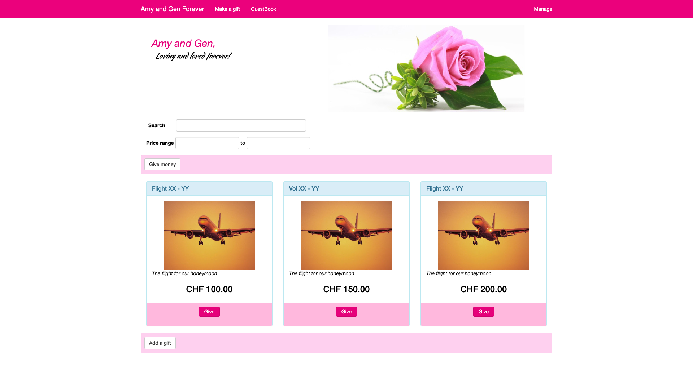
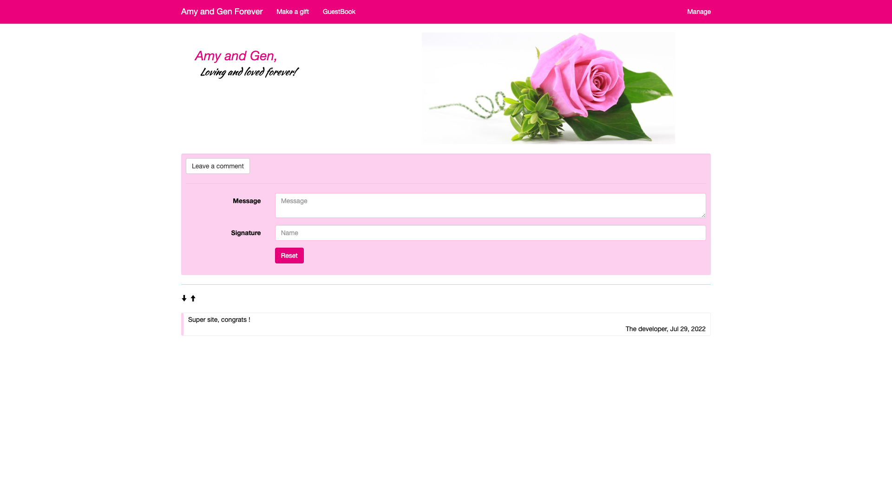

# SI-wedding-site
Little website to manage wedding gifts and golden books.

# Context
Systèmes d'information II, EIA-FR 3th year, fall semester.
Professors: Omar Abou Khaled, Elena Mugellini, Joël Dumoulin, Stefano Carrino.

# Authors 
Lucy Linder
Maria Sisto

----------

*UPDATE 2022 - Backup from NAS*

## How to run

Simply run:
```bash
docker run --rm --name wed -d -p 8080:8080 -p 4848:4848 derlin/wed-live:latest
```

And go to http://localhost:8080/wedding-site

## Preview

### Guest area






### Manage area

